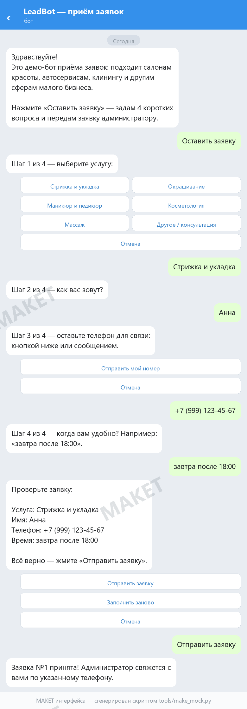

# LeadBot — Telegram-бот приёма заявок (демо для малого бизнеса)

Портфолио-проект: рабочий бот, который салон красоты, автосервис, клининг
и любой другой малый бизнес может поставить как «приёмщик заявок». Клиент
жмёт кнопки, бот задаёт 4 коротких вопроса, сохраняет заявку в базу
и отправляет её владельцу. Код и тесты в репозитории; публичного демо-бота сейчас нет — запуск локально.



> Изображение выше — макет, сгенерированный скриптом `tools/make_mock.py`
> (чтобы показать интерфейс без настоящего токена). Запущенный бот работает так же,
> только кнопки — с эмодзи.

## Как это работает

1. Клиент пишет `/start` — видит приветствие и меню: «🛎 Оставить заявку», «ℹ️ О демо».
2. Пошаговый сбор заявки: услуга (кнопки) → имя → телефон (кнопкой «отправить контакт»
   или текстом) → удобное время. Пустое и бессмысленное не принимается,
   телефон приводится к виду `+7 (999) 123-45-67`.
3. Кнопка «✅ Отправить заявку» — заявка сохраняется в SQLite и уходит владельцу в личку.
   «🔁 Заполнить заново» и «❌ Отмена» работают на любом шаге.
4. Владелец смотрит заявки: `/заявки` (последние 10) и `/статус` (всего и за сегодня).
   Есть латинские алиасы `/leads` и `/stats` — они же в меню команд Telegram.
   Кириллические команды набираются вручную: Bot API не разрешает кириллицу
   в зарегистрированных командах, поэтому они без автодополнения.

## Быстрый старт

Нужен Python 3.10+.

```bash
python -m venv .venv
.venv\Scripts\activate          # Windows; Linux/Mac: source .venv/bin/activate
pip install -r requirements.txt
```

Подставьте токен — любой из трёх способов:

| Способ | Что сделать |
| --- | --- |
| `.env` (рекомендую) | скопировать `.env.example` → `.env`, вписать `TELEGRAM_BOT_TOKEN=...` |
| `config.py` | скопировать `config.example.py` → `config.py`, вписать токен |
| окружение | `$env:TELEGRAM_BOT_TOKEN="..."` (PowerShell) или `set TELEGRAM_BOT_TOKEN=...` (CMD) |

Токен выдаёт [@BotFather](https://t.me/BotFather): `/newbot` → имя → готово.

Запуск:

```bash
python run.py
```

Бот напечатает ссылку вида `https://t.me/имя_бота` и начнёт отвечать.
Остановка — Ctrl+C. Без токена бот не запустится и объяснит, что сделать;
неправильный токен даст понятное сообщение об ошибке 401.

Чтобы получать заявки в личку, впишите свой ID в `ADMIN_ID` (в `.env` или `config.py`).
Узнать его можно ботом [@userinfobot](https://t.me/userinfobot) — напишите ему `/start`.
Без `ADMIN_ID` бот работает, но заявки только сохраняются в базу.

## Примеры запуска

1. Запустите бота со своим токеном (секунды).
2. Откройте чат с ботом у клиента в руках: `/start` → «Оставить заявку» →
   пройдите все 4 шага.
3. Покажите на своём телефоне `/заявки` и `/статус` — заявка пришла, счётчик вырос.
4. Скажите главное: услуги, тексты и логика меняются под бизнес за часы, а не недели.

## Настройка под бизнес

- Список услуг — `SERVICES` в `leadbot/config.py` (или задайте `SERVICES`
  в корневом `config.py`, он перекрывает встроенный).
- Все тексты бота — `leadbot/texts.py`.
- Сколько последних заявок показывает `/заявки` — `RECENT_LEADS_LIMIT` там же.

Заявки хранятся в `data/leads.db` (SQLite, создаётся автоматически).
Посмотреть руками: `python -c "from leadbot.storage import LeadStorage; [print(r) for r in LeadStorage('data/leads.db').recent(20)]"`.

## Проверено

- `python -m py_compile` — синтаксис чист по всем файлам.
- `python -m unittest discover -s tests -v` — 14 тестов: сохранение/чтение/перезапуск
  базы (`leadbot.storage`) и проверки ввода (`leadbot.validators`). Без реального Telegram.
- Запуск без токена — понятная инструкция, код выхода 1.
- Запуск с фейк-токеном — бот стартует, Telegram отвечает 401, бот печатает
  понятное сообщение и останавливается без трейсбека. Конфликт поллинга
  (второй экземпляр) ловится пробным `getUpdates` до старта цикла.
- **Не проверено на живом боте** (нет настоящего токена): сам диалог в Telegram.
  Механики — стандартный `ConversationHandler` из python-telegram-bot; после
  получения токена прогоните сценарий из раздела «Как показать клиенту» — это 5 минут.

## Структура

```
leadbot/
├── run.py                 # точка входа: python run.py
├── requirements.txt
├── .env.example           # образец конфига с токеном
├── config.example.py      # то же самое через config.py
├── leadbot/
│   ├── config.py          # настройки: токен, админ, услуги, база
│   ├── storage.py         # SQLite-хранилище заявок
│   ├── validators.py      # проверка имени/телефона/времени
│   ├── texts.py           # все тексты бота
│   ├── keyboards.py       # кнопки главного меню и шагов
│   └── bot.py             # диалог заявки + админ-команды
├── tests/                 # unit-тесты (unittest, без Telegram)
├── tools/make_mock.py     # генератор макета docs/demo-mock.png (нужен pillow)
└── docs/demo-mock.png
```

## Что можно добавить дальше

Google Sheets вместо SQLite, статусы заявок («в работе / выполнено»),
напоминание владельцу о необработанных заявках, форма с фото.
Всё это обсуждается как апгрейд демо под конкретного заказчика.
